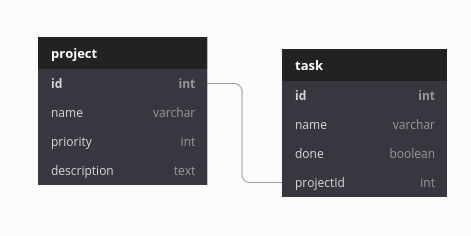

# nodejs-sequelize-restapi-postgres

**This is a simple REST API using Javascript Technologies and PostgreSQL**

+ *Node js*
+ *Express js*
+ *PostgreSQL*
+ *Sequelize*
+ *Docker*

# Modeling
This is the basic relationship that we are using in this example

